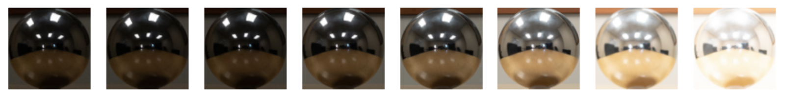
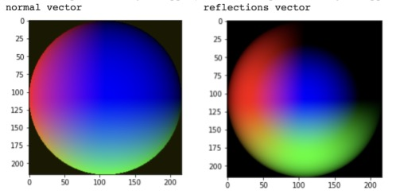
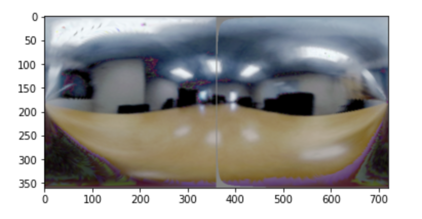
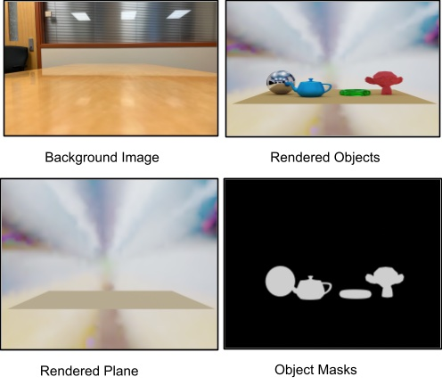
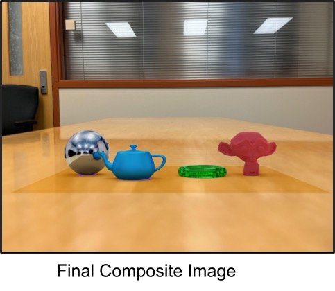

# inserting-artificial-3d-objects

## Goal
In this project, I used High dynamic range (HDR) imaging and image based lighting (IBL) to create HDR images from sequences of low dynamic range (LDR) images. This was used to insert artificial 3D objects into photographs using image-based lighting techniques. 

I focused on my use of image-based lighting, specifically relighting virtual objects. One way I could relight an object was by capturing a 360 degree panoramic (omnidirectional) HDR photograph of a scene, which provided lighting information from all angles incident to the camera (hence the term image-based lighting). Capturing such an image could be difficult with standard cameras, because it required both panoramic image stitching and LDR to HDR conversion. An easier alternative was to capture an HDR photograph of a spherical mirror, which provided the same omni-directional lighting information (up to some physical limitations dependent on sphere size and camera resolution). I took the spherical mirror approach, inspired primarily by Debevec's paper. With this panoramic HDR image, I could then relight 3D models and composite them seamlessly into photographs. This was a very quick method for inserting computer graphics models seamlessly into photographs and videos; it was much faster and more accurate than manually "photoshopping" objects into the photo.

## Results

